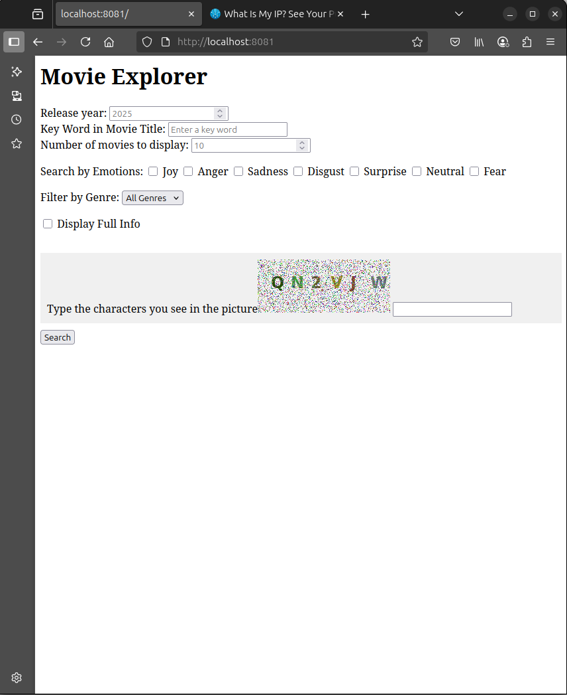
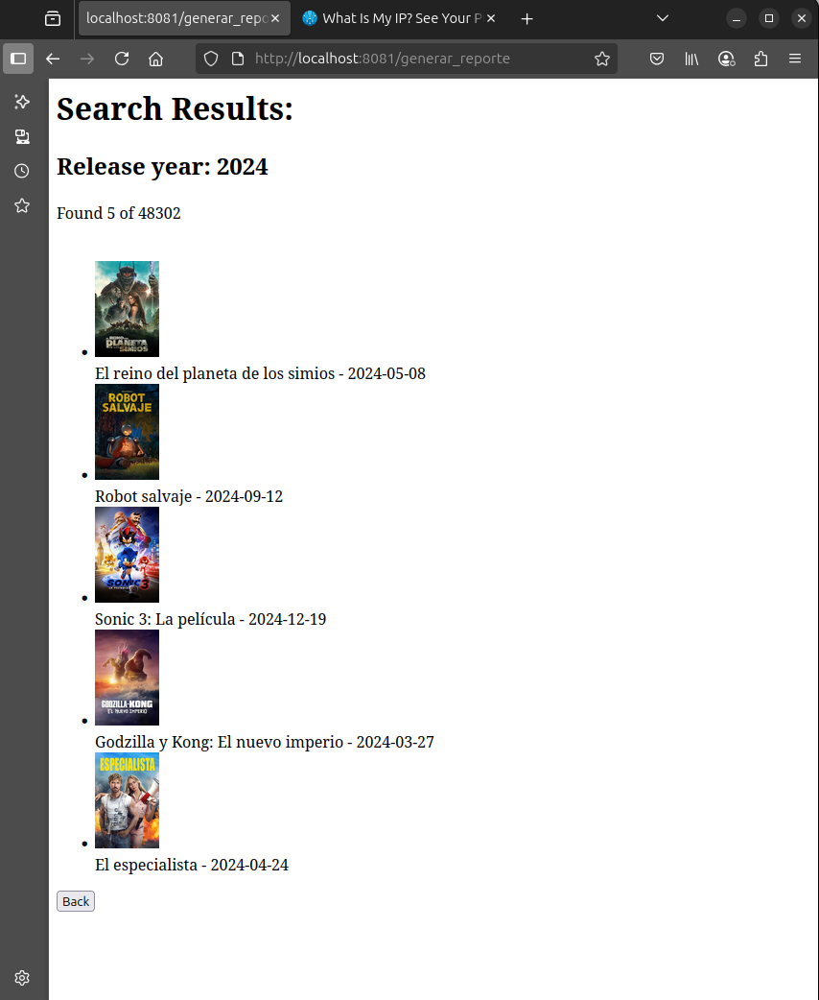
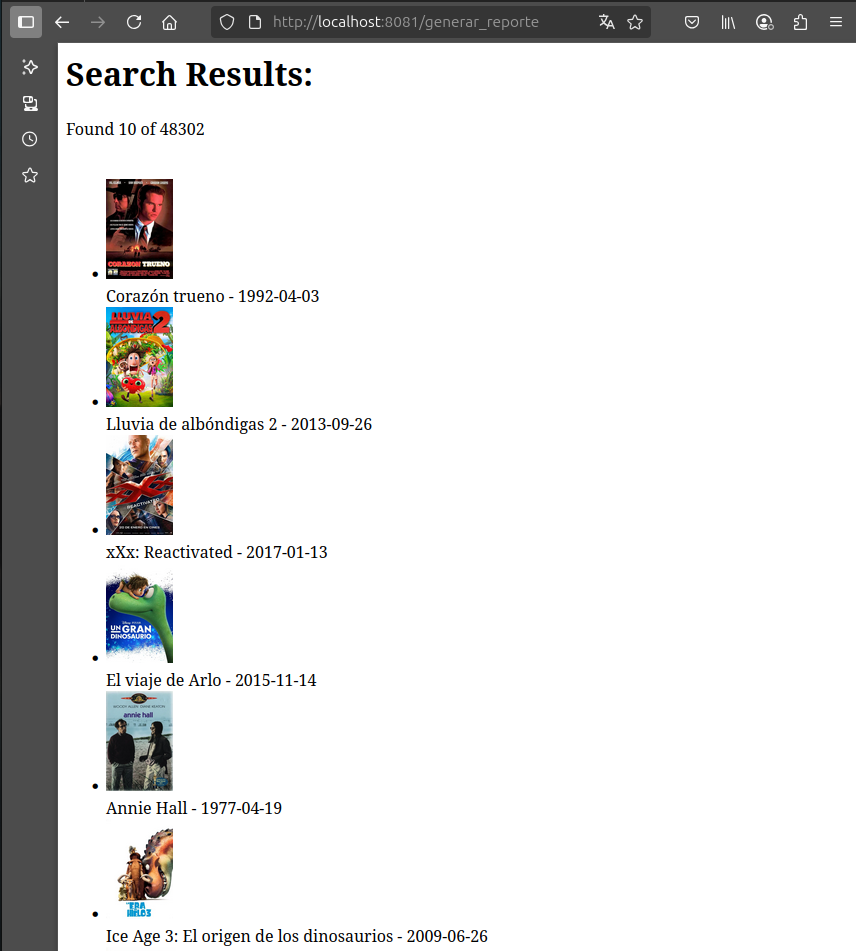

#  Movie Explorer  
### A Mood-Based Movie Recommendation Tool


---

##  Overview
Movie Explorer is a Python-based app that recommends movies based on how you're feeling. By combining data from The Movie Database (TMDB) API with emotion-genre mapping techniques, it helps you find films that match your mood. Whether you're feeling happy, sad, or something in between, Movie Explorer offers personalized suggestions while still letting you filter by genre, release year, or keywords if you want to.

---

## Author

This project was created by Araceli Romero, a student of Information technologies in science(TICs) at [UNAM](https://www.unam.mx/), Mexico.

Movie Explorer was developed as part of the Distributed Computing course (Class of 2025), combining interests in tech, user experience, and media.

Feel free to reach out with questions, feedback, or collaboration ideas to araceliromerozerpa@gmail.com

---

## License

This projects is under [GNU General Public License v3.0](https://www.gnu.org/licenses/gpl-3.0.html).

---

##  Introduction  
Choosing what to watch can be surprisingly stressful, especially with so many options available. Streaming services often recommend content based on popularity or past views, but they rarely take your current emotional state into account. That’s where Movie Explorer comes in, the main idea behind this proyect is simple: help people find a movie that fits how they're feeling.

---

##  Justification  

Choosing what to watch can be hard, especially when you're just looking for something that fits your mood. Most platforms don’t let you search by how you feel, even though that’s how many people decide what to watch.

Movie Explorer tries something different: to use emotions as the starting point. It helps cut down decision time, gives more personal suggestions, and recognizes that movies often make us feel more than one thing—based on real opinions, not just genres.

---

##  Aim
Here’s what the project is aiming for:

- Match Moods to Movies: We’ve linked common emotions (like joy, sadness, fear, etc.) to movie genres, based on thousands of reviews from TMDB. This helps the app suggest films that align with your mood without without needing to scroll endlessly through lists.

- Let You Fine-Tune Results
While emotion is the starting point, you can still narrow things down by release year, keywords, or genre like on most movie sites.

- Show the Human Side of Recommendations
A lot of movies aren’t tied to just one emotion. People might feel a mix of excitement, nostalgia, or even sadness from the same film. That’s part of what makes movies powerful. This project includes those overlaps, based on real opinions from viewers, making recommendations feel more personal and interesting.

- Simple and Expandable
The app is built in Python and uses the TMDB API. It’s meant to be easy to use and modify. In the future, it could even work with emotion-detection tools or personalized mood profiles.
---

##  Installation  

### Requirements
- Python 3.10  
- A free API key from TMDB ([get it here](https://www.themoviedb.org/settings/api))  


### Setup Instructions  
1. Clone the repository 
   ```bash
   git clone https://github.com/Marzerp/movie-explorer.git
   cd movie_explorer
   ```
2. Add your TMDB API key
   - Create a .env file (use .env_example as reference) in the proyect root and add:
   API_KEY=your_api_key

3. Run the project
   ```bash
   docker-compose up --build
   ```
4. Access the app
   - Open your browser and go to https://localhost/

---

## Technologies

- TMDB API
- Python
   - Flask
- MongoDB
- Docker and Docker Compose

---

## A quick look at how Movie Explorer works

- Home Page
<p align="center">  </p>

- Example Search (5 movies of 2024)
<p align="center">  </p>

- Example Search by Emotion (Joy)
<p align="center">  </p>

---

## Conclusions

Movie Explorer is a small but meaningful step toward improving how people discover films. By organizing movie reviews based on emotional tones, the project shows that even simple tools can offer a more personal way to browse content and a different perspective on movie recommendations.

While it’s a small-scale prototype, this app successfully demonstrates how combining public APIs, natural language processing, and emotional tagging can lead to more relatable, personalized recommendations than typical genre or popularity-based systems. It's especially helpful for users who prefer to choose movies based on how they feel, rather than popularity or algorithms. This project doesn't aim to compete with commercial platforms, but rather to explore how mood recognition might enhance user experience.

While there’s significant room for growth, such as multilingual support, more nuanced emotional models, and a refined user interface. This version provides a strong foundation for future work in emotion-aware recommendation systems and user-centered design.

---

## References and Resources

- The Movie Database API
  - https://developers.themoviedb.org/3

- Flask Documentation
  - https://flask.palletsprojects.com

- MongoDB Documentation
  - https://www.mongodb.com/docs

- Docker & Docker Compose
  - https://docs.docker.com/compose/

- Natural Language Procesing
  - Lin, Shangyue. (2024). Text emotional analysis in Natural Language Processing. Applied and Computational Engineering. 36. 163-172. 10.54254/2755-2721/36/20230440.
 
- Lemmanization and Stemming
  - Khyani, Divya & B S, Siddhartha & Niveditha, N. & M., Divya & Y M, Dr. (2021). An Interpretation of Lemmatization and Stemming in Natural Language Processing. Shanghai Ligong Daxue Xuebao/Journal of University of Shanghai for Science and Technology. 22. 350-357.
 
- Emotion English DistilRoBERTa-base
  - Jochen Hartmann, "Emotion English DistilRoBERTa-base". https://huggingface.co/j-hartmann/emotion-english-distilroberta-base/, 2022.
